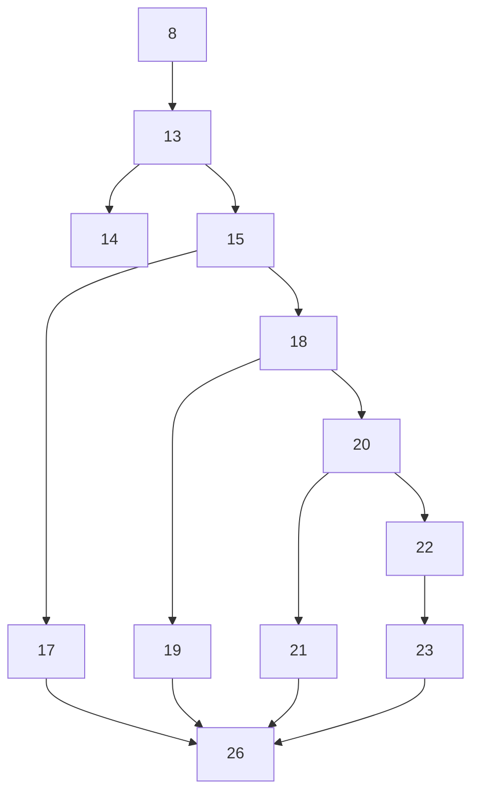
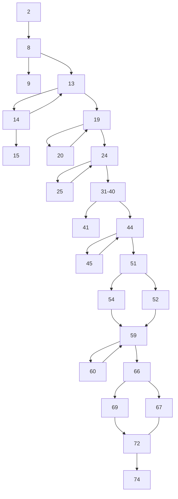

# Resposta Tarefa 022

## GFC Avaliacao

### Código Mermaid

```mermaid
graph TD;
    8-->13;
    13-->14;
    13-->15;
    15-->17;
    15-->18;
    17-->26;
    18-->19;
    18-->20;
    19-->26;
    20-->21;
    20-->22;
    21-->26;
    22-->23;
    23-->26;
```

### Imagem

## GFC ValidaCPF

### Código Mermaid

```mermaid
graph TD;
	2 --> 8;
	8 --> 9;
	13 --> 14;
	14 --> 15;
	19 --> 20;
	20 --> 19;
	19 --> 24;
	24 --> 25;
	25 --> 24;
	24 --> 31-40;
	31-40 --> 41;
	44 --> 45;
	44 --> 51;
	51 --> 52;
	59 --> 60;
	59 --> 66;
	66 --> 67;
	66 --> 69;
	69 --> 72;
	72 --> 74;
	67 --- 72;
	60 --> 59;
	51 --> 54;
	54 --> 59;
	52 --> 59;
	45 --> 44;
	8 --> 13;
	14 --> 13;
	13 --> 19;
	31-40 --> 44;
```

### Imagem

